# Orchestrall Platform - Multi-Industry Architecture Diagram

## 🏗️ **Enterprise AI Agent Orchestration Platform**

```mermaid
graph TB
    %% Client Industries
    subgraph "Industry Clients"
        FIN[🏦 Financial Services<br/>- Risk Assessment<br/>- Fraud Detection<br/>- Compliance Reporting]
        HEALTH[🏥 Healthcare<br/>- Patient Data Analysis<br/>- Medical Records Processing<br/>- Clinical Decision Support]
        RETAIL[🛒 Retail & E-commerce<br/>- Inventory Management<br/>- Customer Analytics<br/>- Price Optimization]
        MANUF[🏭 Manufacturing<br/>- Quality Control<br/>- Predictive Maintenance<br/>- Supply Chain Optimization]
        LOGISTICS[🚚 Logistics & Transportation<br/>- Route Optimization<br/>- Fleet Management<br/>- Delivery Tracking]
        TECH[💻 Technology<br/>- Code Review<br/>- Performance Monitoring<br/>- Security Analysis]
    end

    %% API Gateway Layer
    subgraph "API Gateway & Security Layer"
        GW[🌐 API Gateway<br/>Fastify + Swagger]
        AUTH[🔐 Authentication<br/>JWT + API Keys]
        RATE[⚡ Rate Limiting<br/>Redis-backed]
        SEC[🛡️ Security<br/>Helmet + CORS]
    end

    %% Core Platform Services
    subgraph "Orchestrall Core Platform"
        subgraph "Agent Orchestration Engine"
            AGENT_MGR[🤖 Agent Manager<br/>- 10+ AI Agents<br/>- Dynamic Loading<br/>- Execution Engine]
            
            subgraph "Industry-Specific Agents"
                FIN_AGENTS[💰 Financial Agents<br/>- Risk Calculator<br/>- Fraud Detector<br/>- Compliance Checker]
                HEALTH_AGENTS[🏥 Healthcare Agents<br/>- Data Processor<br/>- Medical Analyzer<br/>- Report Generator]
                RETAIL_AGENTS[🛍️ Retail Agents<br/>- Inventory Optimizer<br/>- Customer Profiler<br/>- Price Analyzer]
                MANUF_AGENTS[⚙️ Manufacturing Agents<br/>- Quality Inspector<br/>- Maintenance Predictor<br/>- Supply Optimizer]
                LOG_AGENTS[🚛 Logistics Agents<br/>- Route Planner<br/>- Fleet Monitor<br/>- Delivery Tracker]
                TECH_AGENTS[💻 Tech Agents<br/>- Code Reviewer<br/>- Performance Monitor<br/>- Security Scanner]
            end
        end

        subgraph "Data & Processing Layer"
            CACHE[⚡ Redis Cache<br/>- Agent Results<br/>- Session Data<br/>- Rate Limiting]
            DB[(🗄️ PostgreSQL<br/>- User Data<br/>- Workflows<br/>- Audit Logs)]
            AI[🧠 AI Services<br/>- OpenAI API<br/>- Custom Models<br/>- LangChain]
        end

        subgraph "Workflow Engine"
            WORKFLOW[🔄 Workflow Manager<br/>- Multi-step Processes<br/>- Conditional Logic<br/>- Error Handling]
            TRIGGER[⚡ Event Triggers<br/>- Scheduled Jobs<br/>- Webhooks<br/>- API Calls]
        end
    end

    %% Infrastructure Layer
    subgraph "Infrastructure & Operations"
        subgraph "Container Orchestration"
            K8S[☸️ Kubernetes<br/>- Auto-scaling<br/>- Load Balancing<br/>- Health Checks]
            DOCKER[🐳 Docker Containers<br/>- Microservices<br/>- Isolated Environments<br/>- Easy Deployment]
        end

        subgraph "Monitoring & Observability"
            PROM[📊 Prometheus<br/>- Metrics Collection<br/>- Performance Monitoring]
            GRAF[📈 Grafana<br/>- Dashboards<br/>- Alerting<br/>- Visualization]
            LOGS[📝 Centralized Logging<br/>- Structured Logs<br/>- Error Tracking<br/>- Audit Trails]
        end

        subgraph "Backup & Recovery"
            BACKUP[💾 Automated Backups<br/>- Database Snapshots<br/>- Configuration Backup<br/>- Disaster Recovery]
            S3[☁️ Cloud Storage<br/>- S3 Integration<br/>- Cross-region Replication<br/>- Version Control]
        end
    end

    %% Integration Layer
    subgraph "External Integrations"
        subgraph "Industry APIs"
            FIN_API[🏦 Financial APIs<br/>- Banking Systems<br/>- Payment Gateways<br/>- Trading Platforms]
            HEALTH_API[🏥 Healthcare APIs<br/>- EHR Systems<br/>- Medical Devices<br/>- Insurance APIs]
            RETAIL_API[🛒 Retail APIs<br/>- POS Systems<br/>- Inventory APIs<br/>- Marketing Platforms]
            MANUF_API[🏭 Manufacturing APIs<br/>- ERP Systems<br/>- IoT Devices<br/>- Quality Systems]
            LOG_API[🚚 Logistics APIs<br/>- Shipping APIs<br/>- GPS Tracking<br/>- Warehouse Systems]
            TECH_API[💻 Tech APIs<br/>- GitHub/GitLab<br/>- CI/CD Systems<br/>- Monitoring Tools]
        end

        subgraph "Communication Channels"
            EMAIL[📧 Email Service<br/>- SMTP Integration<br/>- Notification System]
            SMS[📱 SMS Gateway<br/>- Alert Notifications<br/>- 2FA Support]
            SLACK[💬 Slack Integration<br/>- Team Notifications<br/>- Status Updates]
            WEBHOOK[🔗 Webhooks<br/>- Real-time Events<br/>- Third-party Integration]
        end
    end

    %% Data Flow Connections
    FIN --> GW
    HEALTH --> GW
    RETAIL --> GW
    MANUF --> GW
    LOGISTICS --> GW
    TECH --> GW

    GW --> AUTH
    GW --> RATE
    GW --> SEC

    AUTH --> AGENT_MGR
    RATE --> AGENT_MGR
    SEC --> AGENT_MGR

    AGENT_MGR --> FIN_AGENTS
    AGENT_MGR --> HEALTH_AGENTS
    AGENT_MGR --> RETAIL_AGENTS
    AGENT_MGR --> MANUF_AGENTS
    AGENT_MGR --> LOG_AGENTS
    AGENT_MGR --> TECH_AGENTS

    FIN_AGENTS --> FIN_API
    HEALTH_AGENTS --> HEALTH_API
    RETAIL_AGENTS --> RETAIL_API
    MANUF_AGENTS --> MANUF_API
    LOG_AGENTS --> LOG_API
    TECH_AGENTS --> TECH_API

    AGENT_MGR --> CACHE
    AGENT_MGR --> DB
    AGENT_MGR --> AI

    WORKFLOW --> AGENT_MGR
    TRIGGER --> WORKFLOW

    AGENT_MGR --> K8S
    K8S --> DOCKER

    PROM --> GRAF
    LOGS --> PROM
    AGENT_MGR --> PROM

    BACKUP --> S3
    DB --> BACKUP

    EMAIL --> FIN
    EMAIL --> HEALTH
    EMAIL --> RETAIL
    SMS --> MANUF
    SMS --> LOGISTICS
    SLACK --> TECH
    WEBHOOK --> FIN_API
    WEBHOOK --> HEALTH_API

    %% Styling
    classDef industryClient fill:#e1f5fe,stroke:#01579b,stroke-width:2px
    classDef platformCore fill:#f3e5f5,stroke:#4a148c,stroke-width:2px
    classDef infrastructure fill:#e8f5e8,stroke:#1b5e20,stroke-width:2px
    classDef integration fill:#fff3e0,stroke:#e65100,stroke-width:2px

    class FIN,HEALTH,RETAIL,MANUF,LOGISTICS,TECH industryClient
    class AGENT_MGR,WORKFLOW,CACHE,DB,AI platformCore
    class K8S,DOCKER,PROM,GRAF,LOGS,BACKUP,S3 infrastructure
    class FIN_API,HEALTH_API,RETAIL_API,MANUF_API,LOG_API,TECH_API,EMAIL,SMS,SLACK,WEBHOOK integration
```

## 🎯 **Industry-Specific Use Cases**

### 🏦 **Financial Services**
- **Risk Assessment**: AI agents analyze market data and calculate risk scores
- **Fraud Detection**: Real-time transaction monitoring and anomaly detection
- **Compliance Reporting**: Automated regulatory compliance checks and reporting
- **Customer Analytics**: Personalized financial product recommendations

### 🏥 **Healthcare**
- **Patient Data Analysis**: AI-powered analysis of medical records and test results
- **Clinical Decision Support**: Evidence-based treatment recommendations
- **Medical Records Processing**: Automated extraction and structuring of patient data
- **Drug Interaction Checking**: Real-time medication safety analysis

### 🛒 **Retail & E-commerce**
- **Inventory Management**: Predictive analytics for stock optimization
- **Customer Analytics**: Behavioral analysis and personalized recommendations
- **Price Optimization**: Dynamic pricing based on market conditions
- **Supply Chain Management**: End-to-end visibility and optimization

### 🏭 **Manufacturing**
- **Quality Control**: Automated inspection and defect detection
- **Predictive Maintenance**: Equipment failure prediction and scheduling
- **Supply Chain Optimization**: Vendor management and logistics planning
- **Production Planning**: Demand forecasting and capacity planning

### 🚚 **Logistics & Transportation**
- **Route Optimization**: AI-powered delivery route planning
- **Fleet Management**: Vehicle tracking and maintenance scheduling
- **Delivery Tracking**: Real-time shipment monitoring
- **Warehouse Management**: Inventory optimization and space utilization

### 💻 **Technology**
- **Code Review**: Automated code quality analysis and security scanning
- **Performance Monitoring**: Application performance optimization
- **Security Analysis**: Vulnerability assessment and threat detection
- **DevOps Automation**: CI/CD pipeline optimization and deployment

## 🔧 **Platform Capabilities**

### **Multi-Tenant Architecture**
- Isolated environments for each industry client
- Customizable agent configurations per tenant
- Role-based access control and permissions
- Data segregation and privacy compliance

### **Scalable Infrastructure**
- Kubernetes orchestration for auto-scaling
- Microservices architecture for independent scaling
- Redis caching for performance optimization
- Load balancing across multiple instances

### **Enterprise Security**
- JWT authentication with API key management
- Rate limiting and DDoS protection
- Audit logging and compliance reporting
- Encryption at rest and in transit

### **Monitoring & Observability**
- Real-time performance metrics
- Industry-specific dashboards
- Automated alerting and notifications
- Comprehensive audit trails

## 🚀 **Deployment Options**

### **Cloud-Native Deployment**
- AWS EKS, Google GKE, or Azure AKS
- Auto-scaling based on demand
- Multi-region deployment for high availability
- Cloud-native monitoring and logging

### **On-Premises Deployment**
- Private Kubernetes clusters
- Air-gapped environments for sensitive industries
- Custom security and compliance requirements
- Hybrid cloud integration

### **Hybrid Deployment**
- Core platform in cloud
- Sensitive data processing on-premises
- Edge computing for real-time requirements
- Flexible data residency options

---

*This architecture diagram shows how the Orchestrall Platform provides a unified, scalable solution that can be customized and deployed across multiple industries while maintaining enterprise-grade security, performance, and reliability.*
