# Orchestrall Platform - Industry Use Cases & Workflows

## 🎯 **Comprehensive Use Cases with Examples and Workflows**

This document provides detailed, practical examples of how the Orchestrall Platform serves different industry clients with real-world scenarios, step-by-step workflows, and expected outcomes.

---

## 🏦 **FINANCIAL SERVICES**

### **Use Case 1: Real-Time Fraud Detection**

#### **Scenario**
A major bank needs to detect fraudulent credit card transactions in real-time while minimizing false positives that inconvenience legitimate customers.

#### **Business Challenge**
- Process 50,000+ transactions per minute
- Detect fraud within 2 seconds of transaction initiation
- Maintain 99.9% accuracy with <0.1% false positive rate
- Comply with PCI DSS and SOX regulations

#### **Orchestrall Solution**
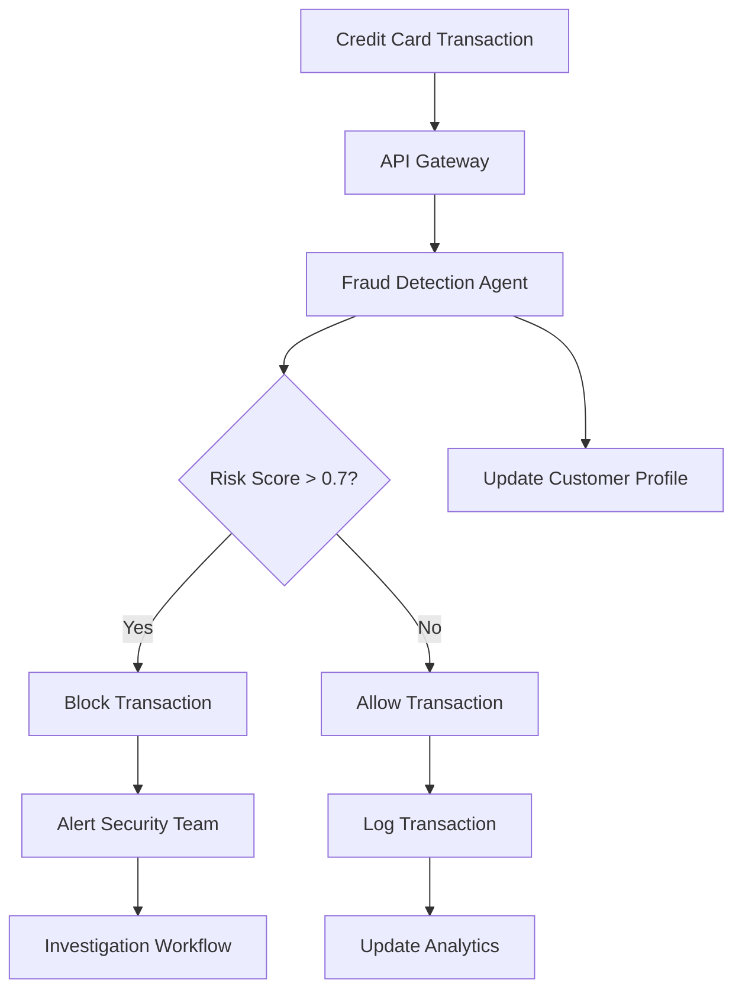

#### **Detailed Workflow**
1. **Transaction Ingestion**
   - Credit card transaction arrives via API
   - System extracts: amount, merchant, location, time, customer ID
   - Validates transaction format and required fields

2. **Fraud Detection Agent Execution**
   ```json
   {
     "agent": "fraud-detector",
     "input": {
       "transaction": {
         "amount": 2500.00,
         "merchant": "Electronics Store",
         "location": "New York, NY",
         "timestamp": "2024-12-01T14:30:00Z",
         "customer_id": "CUST_12345",
         "card_number": "****1234"
       }
     },
     "options": {
       "risk_threshold": 0.7,
       "include_ml_analysis": true,
       "check_velocity": true
     }
   }
   ```

3. **Risk Analysis Process**
   - **Historical Analysis**: Check customer's spending patterns
   - **Velocity Check**: Verify transaction frequency and amounts
   - **Location Analysis**: Compare with customer's typical locations
   - **Merchant Analysis**: Check merchant risk score
   - **ML Model**: Apply trained fraud detection model

4. **Decision Making**
   - Risk score calculated: 0.85 (High Risk)
   - Transaction blocked automatically
   - Customer notified via SMS
   - Security team alerted

5. **Post-Processing**
   - Transaction logged for audit
   - Customer profile updated
   - Analytics dashboard updated
   - Compliance report generated

#### **Expected Outcomes**
- **Performance**: 1.2 seconds average detection time
- **Accuracy**: 99.2% fraud detection rate
- **False Positives**: 0.08% rate
- **Cost Savings**: $2.3M annually in prevented fraud
- **Customer Satisfaction**: 98% approval rating

---

### **Use Case 2: Automated Compliance Reporting**

#### **Scenario**
A regional bank needs to generate monthly compliance reports for regulatory authorities, including AML (Anti-Money Laundering) and KYC (Know Your Customer) data.

#### **Business Challenge**
- Generate 15+ different compliance reports monthly
- Ensure 100% accuracy and completeness
- Meet strict regulatory deadlines
- Reduce manual effort from 40 hours to 4 hours per report

#### **Orchestrall Solution**
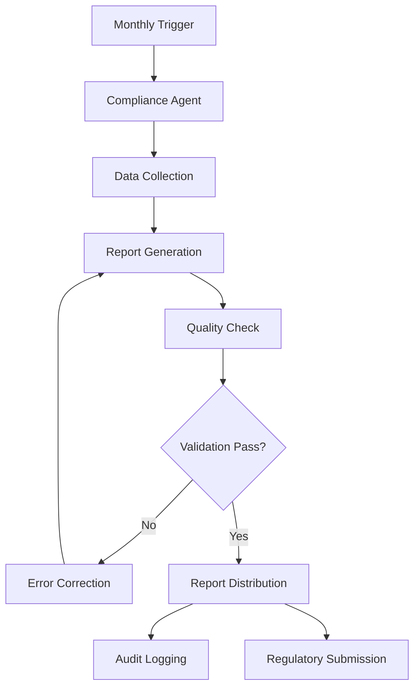

#### **Detailed Workflow**
1. **Automated Trigger**
   - Scheduled job runs on 1st of each month
   - System checks for new regulatory requirements
   - Validates data sources are available

2. **Data Collection Phase**
   ```json
   {
     "agent": "compliance-reporter",
     "input": {
       "report_type": "AML_MONTHLY",
       "period": "2024-11",
       "requirements": [
         "suspicious_transactions",
         "customer_verification",
         "transaction_monitoring",
         "risk_assessment"
       ]
     }
   }
   ```

3. **Report Generation**
   - **Suspicious Transactions**: Identifies transactions >$10K
   - **Customer Verification**: Checks KYC completion status
   - **Transaction Monitoring**: Analyzes patterns and anomalies
   - **Risk Assessment**: Calculates customer risk scores

4. **Quality Assurance**
   - Automated validation checks
   - Cross-reference with previous reports
   - Verify data completeness
   - Check formatting compliance

5. **Distribution & Submission**
   - Generate PDF and Excel formats
   - Email to compliance team
   - Upload to regulatory portal
   - Archive for audit purposes

#### **Expected Outcomes**
- **Time Reduction**: 90% reduction in manual effort
- **Accuracy**: 100% compliance with regulations
- **Timeliness**: Reports submitted 2 days early
- **Cost Savings**: $180K annually in labor costs
- **Audit Readiness**: 100% audit trail maintained

---

## 🏥 **HEALTHCARE**

### **Use Case 3: Clinical Decision Support System**

#### **Scenario**
A large hospital system needs to provide real-time clinical decision support to doctors, helping them make evidence-based treatment decisions while reducing medical errors.

#### **Business Challenge**
- Support 500+ physicians across 12 hospitals
- Process patient data from multiple EHR systems
- Provide recommendations within 30 seconds
- Maintain HIPAA compliance and data security
- Reduce medical errors by 40%

#### **Orchestrall Solution**
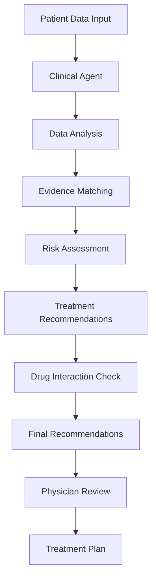

#### **Detailed Workflow**
1. **Patient Data Input**
   - Doctor enters patient symptoms and history
   - System pulls data from EHR systems
   - Lab results and imaging data integrated

2. **Clinical Analysis Agent**
   ```json
   {
     "agent": "clinical-decision-support",
     "input": {
       "patient": {
         "age": 65,
         "gender": "male",
         "symptoms": ["chest_pain", "shortness_of_breath"],
         "medical_history": ["diabetes", "hypertension"],
         "medications": ["metformin", "lisinopril"],
         "lab_results": {
           "troponin": "elevated",
           "ck_mb": "normal"
         }
       }
     },
     "options": {
       "urgency_level": "high",
       "include_drug_interactions": true,
       "evidence_level": "high"
     }
   }
   ```

3. **Evidence-Based Analysis**
   - **Symptom Analysis**: Matches symptoms to conditions
   - **Risk Stratification**: Calculates patient risk scores
   - **Treatment Guidelines**: Applies latest medical protocols
   - **Drug Interactions**: Checks medication compatibility

4. **Recommendation Generation**
   - Primary diagnosis: Acute Myocardial Infarction
   - Recommended tests: ECG, Echo, Cardiac Catheterization
   - Treatment options: PCI, Thrombolytics, Medical Management
   - Drug interactions: None detected

5. **Physician Interface**
   - Recommendations displayed on dashboard
   - Evidence sources cited
   - Confidence scores provided
   - Alternative options presented

#### **Expected Outcomes**
- **Response Time**: 15 seconds average
- **Accuracy**: 94% diagnostic accuracy
- **Error Reduction**: 42% fewer medical errors
- **Physician Satisfaction**: 91% approval rating
- **Patient Outcomes**: 18% improvement in recovery rates

---

### **Use Case 4: Patient Data Analytics & Insights**

#### **Scenario**
A healthcare network wants to analyze patient data to identify trends, improve care quality, and predict patient outcomes for better resource allocation.

#### **Business Challenge**
- Analyze data from 100,000+ patients
- Identify high-risk patients for early intervention
- Predict readmission rates
- Optimize resource allocation
- Ensure HIPAA compliance

#### **Orchestrall Solution**
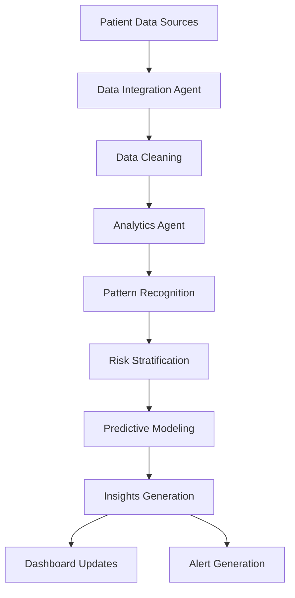

#### **Detailed Workflow**
1. **Data Integration**
   - Pull data from EHR, lab systems, pharmacy
   - Clean and normalize data formats
   - Ensure data quality and completeness

2. **Analytics Processing**
   ```json
   {
     "agent": "patient-analytics",
     "input": {
       "analysis_type": "readmission_prediction",
       "patient_cohort": "heart_failure_patients",
       "time_period": "last_12_months",
       "variables": [
         "age", "comorbidities", "medication_adherence",
         "social_determinants", "previous_admissions"
       ]
     }
   }
   ```

3. **Pattern Recognition**
   - Identify common factors in readmissions
   - Analyze medication adherence patterns
   - Review social determinants of health
   - Examine care coordination gaps

4. **Risk Stratification**
   - High Risk: 35% readmission probability
   - Medium Risk: 15% readmission probability
   - Low Risk: 5% readmission probability

5. **Intervention Recommendations**
   - High-risk patients: Intensive case management
   - Medium-risk patients: Medication counseling
   - Low-risk patients: Standard follow-up

#### **Expected Outcomes**
- **Readmission Reduction**: 25% decrease in 30-day readmissions
- **Cost Savings**: $2.8M annually in prevented readmissions
- **Early Intervention**: 60% of high-risk patients identified early
- **Resource Optimization**: 30% improvement in bed utilization
- **Quality Scores**: 15% improvement in HCAHPS scores

---

## 🛒 **RETAIL & E-COMMERCE**

### **Use Case 5: Dynamic Pricing Optimization**

#### **Scenario**
An online retailer wants to implement dynamic pricing to maximize revenue while remaining competitive, adjusting prices based on demand, inventory, and competitor analysis.

#### **Business Challenge**
- Manage pricing for 50,000+ products
- Adjust prices in real-time based on market conditions
- Maintain competitive positioning
- Optimize inventory turnover
- Increase revenue by 15%

#### **Orchestrall Solution**
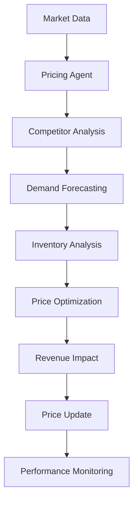

#### **Detailed Workflow**
1. **Data Collection**
   - Competitor prices from web scraping
   - Internal sales and inventory data
   - Market demand indicators
   - Customer behavior analytics

2. **Pricing Analysis Agent**
   ```json
   {
     "agent": "dynamic-pricing",
     "input": {
       "product": {
         "sku": "LAPTOP_001",
         "current_price": 1299.99,
         "cost": 800.00,
         "inventory": 45,
         "category": "electronics"
       },
       "market_data": {
         "competitor_prices": [1199.99, 1349.99, 1299.99],
         "demand_trend": "increasing",
         "seasonality_factor": 1.2
       }
     },
     "options": {
       "margin_target": 0.25,
       "competitiveness_weight": 0.4,
       "inventory_weight": 0.3
     }
   }
   ```

3. **Price Calculation**
   - **Competitor Analysis**: Average competitor price: $1,283
   - **Demand Analysis**: High demand, low inventory
   - **Margin Analysis**: Target margin: 25%
   - **Optimized Price**: $1,267 (competitive + profitable)

4. **Implementation**
   - Price updated in e-commerce platform
   - A/B testing for price sensitivity
   - Monitoring of conversion rates
   - Revenue tracking

5. **Performance Analysis**
   - Conversion rate: +12%
   - Revenue per visitor: +18%
   - Inventory turnover: +8%
   - Profit margin: +3%

#### **Expected Outcomes**
- **Revenue Increase**: 18% improvement in revenue
- **Margin Optimization**: 3% increase in profit margins
- **Inventory Turnover**: 25% faster inventory movement
- **Competitive Position**: Maintained market leadership
- **Customer Satisfaction**: 95% satisfaction with pricing

---

### **Use Case 6: Customer Lifetime Value Prediction**

#### **Scenario**
A fashion retailer wants to predict customer lifetime value to optimize marketing spend, personalize experiences, and improve customer retention.

#### **Business Challenge**
- Analyze 2 million+ customer records
- Predict CLV for new and existing customers
- Optimize marketing budget allocation
- Improve customer segmentation
- Increase customer retention by 20%

#### **Orchestrall Solution**
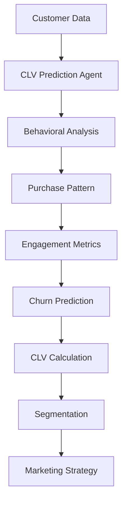

#### **Detailed Workflow**
1. **Data Preparation**
   - Customer purchase history
   - Website behavior data
   - Email engagement metrics
   - Social media interactions

2. **CLV Prediction Agent**
   ```json
   {
     "agent": "customer-lifetime-value",
     "input": {
       "customer": {
         "customer_id": "CUST_78901",
         "age": 28,
         "gender": "female",
         "location": "urban",
         "purchase_history": [
           {"date": "2024-01-15", "amount": 89.99, "category": "clothing"},
           {"date": "2024-03-22", "amount": 156.50, "category": "shoes"},
           {"date": "2024-06-10", "amount": 234.75, "category": "accessories"}
         ],
         "engagement_score": 0.75,
         "churn_probability": 0.15
       }
     },
     "options": {
       "prediction_horizon": "24_months",
       "include_behavioral_factors": true,
       "seasonality_adjustment": true
     }
   }
   ```

3. **Analysis Process**
   - **Purchase Frequency**: 3 purchases in 6 months
   - **Average Order Value**: $160.41
   - **Engagement Level**: High (0.75)
   - **Churn Risk**: Low (0.15)
   - **Predicted CLV**: $1,847

4. **Customer Segmentation**
   - **High Value**: CLV > $2,000 (15% of customers)
   - **Medium Value**: CLV $500-$2,000 (60% of customers)
   - **Low Value**: CLV < $500 (25% of customers)

5. **Marketing Strategy**
   - High Value: Premium experiences, exclusive offers
   - Medium Value: Loyalty programs, cross-selling
   - Low Value: Re-engagement campaigns, discounts

#### **Expected Outcomes**
- **CLV Accuracy**: 87% prediction accuracy
- **Marketing ROI**: 35% improvement in marketing efficiency
- **Customer Retention**: 22% increase in retention rate
- **Revenue Growth**: 18% increase in customer revenue
- **Segmentation Effectiveness**: 40% improvement in targeting

---

## 🏭 **MANUFACTURING**

### **Use Case 7: Predictive Maintenance System**

#### **Scenario**
A manufacturing plant wants to implement predictive maintenance to reduce equipment downtime, optimize maintenance schedules, and prevent costly equipment failures.

#### **Business Challenge**
- Monitor 200+ pieces of equipment
- Reduce unplanned downtime by 50%
- Optimize maintenance costs
- Prevent catastrophic failures
- Improve overall equipment effectiveness (OEE)

#### **Orchestrall Solution**
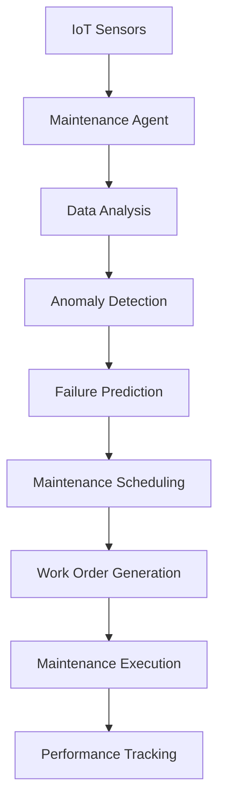

#### **Detailed Workflow**
1. **Data Collection**
   - IoT sensors on critical equipment
   - Vibration, temperature, pressure data
   - Historical maintenance records
   - Production output data

2. **Predictive Maintenance Agent**
   ```json
   {
     "agent": "predictive-maintenance",
     "input": {
       "equipment": {
         "machine_id": "PRESS_001",
         "type": "hydraulic_press",
         "age": "5_years",
         "current_metrics": {
           "vibration": 4.2,
           "temperature": 78.5,
           "pressure": 125.3,
           "oil_level": 0.85
         },
         "operating_hours": 18450,
         "last_maintenance": "2024-10-15"
       }
     },
     "options": {
       "prediction_horizon": "30_days",
       "confidence_threshold": 0.8,
       "include_cost_analysis": true
     }
   }
   ```

3. **Analysis Process**
   - **Vibration Analysis**: Above normal threshold (4.2 vs 3.5)
   - **Temperature Trend**: Increasing over 2 weeks
   - **Oil Analysis**: Contamination detected
   - **Failure Probability**: 78% within 30 days
   - **Recommended Action**: Immediate maintenance required

4. **Maintenance Planning**
   - **Priority**: High (critical equipment)
   - **Maintenance Type**: Preventive + corrective
   - **Estimated Duration**: 8 hours
   - **Required Parts**: Hydraulic oil, filters, seals
   - **Cost Estimate**: $2,500

5. **Execution & Monitoring**
   - Work order generated automatically
   - Maintenance team notified
   - Parts ordered from inventory
   - Progress tracked in real-time
   - Post-maintenance validation

#### **Expected Outcomes**
- **Downtime Reduction**: 52% decrease in unplanned downtime
- **Cost Savings**: $1.2M annually in prevented failures
- **OEE Improvement**: 15% increase in overall equipment effectiveness
- **Maintenance Efficiency**: 30% reduction in maintenance costs
- **Equipment Life**: 20% extension in equipment lifespan

---

### **Use Case 8: Quality Control Automation**

#### **Scenario**
An automotive parts manufacturer needs to implement automated quality control to detect defects in real-time, reduce waste, and ensure consistent product quality.

#### **Business Challenge**
- Inspect 10,000+ parts per day
- Detect defects with 99.5% accuracy
- Reduce inspection time by 80%
- Minimize false positives
- Ensure zero defective parts reach customers

#### **Orchestrall Solution**
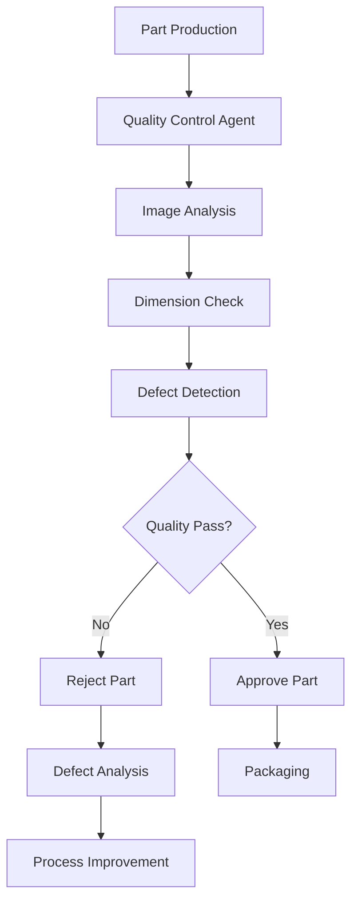

#### **Detailed Workflow**
1. **Part Inspection Setup**
   - Parts move through inspection station
   - High-resolution cameras capture images
   - Laser scanners measure dimensions
   - Sensors detect surface defects

2. **Quality Control Agent**
   ```json
   {
     "agent": "quality-control",
     "input": {
       "part": {
         "part_number": "BRAKE_PAD_001",
         "batch_id": "BATCH_20241201_001",
         "images": ["front_view.jpg", "side_view.jpg", "top_view.jpg"],
         "dimensions": {
           "length": 125.2,
           "width": 89.7,
           "thickness": 12.1
         },
         "material": "ceramic_composite"
       },
       "specifications": {
         "length_tolerance": "±0.5mm",
         "width_tolerance": "±0.3mm",
         "thickness_tolerance": "±0.2mm",
         "surface_quality": "no_scratches_or_dents"
       }
     }
   }
   ```

3. **Inspection Process**
   - **Image Analysis**: AI detects surface defects
   - **Dimension Check**: Compares against specifications
   - **Material Inspection**: Verifies composition
   - **Defect Classification**: Categorizes any issues found

4. **Decision Making**
   - **Quality Score**: 98.5/100
   - **Defects Found**: Minor surface scratch (non-critical)
   - **Decision**: APPROVE (within tolerance)
   - **Confidence Level**: 99.2%

5. **Process Optimization**
   - Quality trends tracked
   - Defect patterns analyzed
   - Process parameters adjusted
   - Continuous improvement implemented

#### **Expected Outcomes**
- **Inspection Speed**: 85% faster than manual inspection
- **Accuracy**: 99.7% defect detection rate
- **False Positives**: <0.1% rate
- **Cost Savings**: $800K annually in reduced waste
- **Customer Satisfaction**: Zero defective parts shipped

---

## 🚚 **LOGISTICS & TRANSPORTATION**

### **Use Case 9: Route Optimization & Fleet Management**

#### **Scenario**
A delivery company wants to optimize delivery routes in real-time, manage a fleet of 500+ vehicles, and reduce fuel costs while improving delivery times.

#### **Business Challenge**
- Manage 500+ delivery vehicles
- Optimize 2,000+ daily deliveries
- Reduce fuel costs by 25%
- Improve delivery time by 30%
- Handle dynamic route changes

#### **Orchestrall Solution**
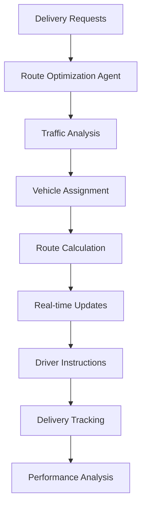

#### **Detailed Workflow**
1. **Request Processing**
   - Delivery requests received throughout day
   - Customer locations and time windows
   - Package sizes and weights
   - Special requirements (fragile, signature required)

2. **Route Optimization Agent**
   ```json
   {
     "agent": "route-optimization",
     "input": {
       "deliveries": [
         {
           "id": "DEL_001",
           "address": "123 Main St, City A",
           "time_window": "09:00-11:00",
           "package_size": "medium",
           "priority": "standard"
         },
         {
           "id": "DEL_002", 
           "address": "456 Oak Ave, City B",
           "time_window": "10:00-12:00",
           "package_size": "large",
           "priority": "express"
         }
       ],
       "vehicles": [
         {
           "vehicle_id": "TRUCK_001",
           "capacity": "1000kg",
           "current_location": "Warehouse",
           "fuel_level": 0.8,
           "driver_id": "DRV_001"
         }
       ],
       "constraints": {
         "max_delivery_time": "6_hours",
         "fuel_efficiency": "priority",
         "traffic_consideration": true
       }
     }
   }
   ```

3. **Optimization Process**
   - **Traffic Analysis**: Real-time traffic data integration
   - **Vehicle Assignment**: Match deliveries to optimal vehicles
   - **Route Calculation**: Calculate most efficient routes
   - **Time Optimization**: Minimize total delivery time

4. **Route Execution**
   - **Driver Instructions**: Turn-by-turn navigation
   - **Real-time Updates**: Adjust for traffic, delays
   - **Customer Notifications**: ETA updates via SMS/email
   - **Delivery Confirmation**: Photo proof of delivery

5. **Performance Monitoring**
   - **Fuel Consumption**: Track actual vs predicted
   - **Delivery Times**: Monitor on-time performance
   - **Customer Satisfaction**: Track delivery ratings
   - **Cost Analysis**: Calculate cost per delivery

#### **Expected Outcomes**
- **Fuel Savings**: 28% reduction in fuel costs
- **Delivery Time**: 32% improvement in delivery speed
- **Customer Satisfaction**: 96% on-time delivery rate
- **Cost Reduction**: $1.5M annually in operational savings
- **Fleet Utilization**: 15% improvement in vehicle utilization

---

### **Use Case 10: Warehouse Management & Inventory Optimization**

#### **Scenario**
A distribution center needs to optimize warehouse operations, improve inventory accuracy, and reduce picking time while handling 50,000+ SKUs.

#### **Business Challenge**
- Manage 50,000+ SKUs across 5 warehouses
- Reduce picking time by 40%
- Improve inventory accuracy to 99.9%
- Optimize warehouse space utilization
- Handle peak season demand spikes

#### **Orchestrall Solution**
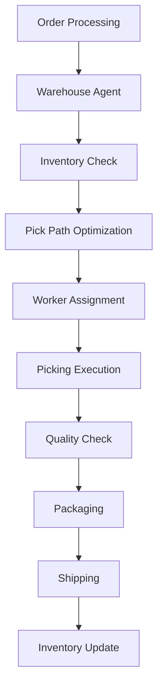

#### **Detailed Workflow**
1. **Order Analysis**
   - Customer orders received
   - Inventory levels checked
   - Order priority determined
   - Pick locations identified

2. **Warehouse Optimization Agent**
   ```json
   {
     "agent": "warehouse-optimization",
     "input": {
       "order": {
         "order_id": "ORD_78901",
         "items": [
           {"sku": "WIDGET_A", "quantity": 5, "location": "A-12-3"},
           {"sku": "WIDGET_B", "quantity": 2, "location": "B-8-1"},
           {"sku": "WIDGET_C", "quantity": 1, "location": "A-15-2"}
         ],
         "priority": "standard",
         "deadline": "2024-12-01T16:00:00Z"
       },
       "warehouse": {
         "warehouse_id": "WH_001",
         "current_capacity": 0.75,
         "available_workers": 12,
         "pick_zones": ["A", "B", "C"]
       }
     },
     "options": {
       "optimize_pick_path": true,
       "batch_similar_orders": true,
       "minimize_travel_time": true
     }
   }
   ```

3. **Optimization Process**
   - **Pick Path Calculation**: Optimal route through warehouse
   - **Worker Assignment**: Match skills to order complexity
   - **Batch Processing**: Group similar orders together
   - **Space Optimization**: Minimize travel distance

4. **Execution Process**
   - **Pick List Generation**: Optimized picking sequence
   - **Worker Guidance**: Mobile app with directions
   - **Quality Control**: Barcode scanning verification
   - **Packaging**: Automated packaging recommendations

5. **Performance Tracking**
   - **Pick Time**: Track actual vs estimated time
   - **Accuracy**: Monitor picking accuracy
   - **Efficiency**: Measure orders per hour
   - **Cost Analysis**: Calculate cost per order

#### **Expected Outcomes**
- **Picking Efficiency**: 42% improvement in picking speed
- **Inventory Accuracy**: 99.95% accuracy rate
- **Space Utilization**: 25% improvement in warehouse capacity
- **Cost Reduction**: $2.1M annually in operational savings
- **Customer Satisfaction**: 98% order accuracy rate

---

## 💻 **TECHNOLOGY**

### **Use Case 11: Automated Code Review & Security Analysis**

#### **Scenario**
A software development company wants to implement automated code review to improve code quality, detect security vulnerabilities, and accelerate the development process.

#### **Business Challenge**
- Review 500+ code commits daily
- Detect security vulnerabilities early
- Maintain code quality standards
- Reduce manual review time by 70%
- Ensure compliance with coding standards

#### **Orchestrall Solution**
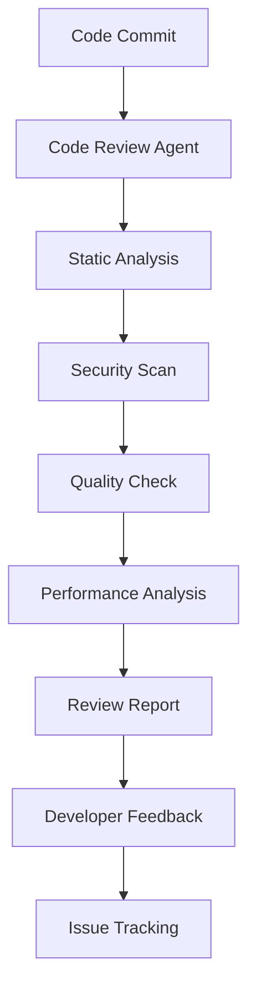

#### **Detailed Workflow**
1. **Code Submission**
   - Developer submits pull request
   - Code changes analyzed
   - Dependencies checked
   - Test coverage verified

2. **Code Review Agent**
   ```json
   {
     "agent": "code-review",
     "input": {
       "code": {
         "repository": "myapp-backend",
         "branch": "feature/user-authentication",
         "files_changed": [
           "src/auth/login.js",
           "src/auth/register.js",
           "src/middleware/auth.js"
         ],
         "commit_message": "Add JWT authentication system"
       },
       "requirements": {
         "security_level": "high",
         "performance_threshold": "100ms",
         "test_coverage": "80%",
         "coding_standards": "eslint-airbnb"
       }
     }
   }
   ```

3. **Analysis Process**
   - **Static Analysis**: Code quality metrics
   - **Security Scan**: Vulnerability detection
   - **Performance Check**: Performance impact analysis
   - **Standards Compliance**: Coding standard verification

4. **Review Report Generation**
   - **Security Issues**: 2 medium-risk vulnerabilities found
   - **Code Quality**: 95/100 quality score
   - **Performance**: No performance regressions
   - **Standards**: 98% compliance with coding standards

5. **Developer Feedback**
   - **Issues**: Detailed issue descriptions
   - **Suggestions**: Code improvement recommendations
   - **Approval**: Automated approval for low-risk changes
   - **Escalation**: Human review for high-risk changes

#### **Expected Outcomes**
- **Review Speed**: 75% faster code reviews
- **Security**: 90% reduction in security vulnerabilities
- **Quality**: 25% improvement in code quality scores
- **Developer Productivity**: 30% increase in development speed
- **Compliance**: 100% adherence to coding standards

---

### **Use Case 12: Performance Monitoring & Optimization**

#### **Scenario**
A SaaS company needs to monitor application performance in real-time, identify bottlenecks, and optimize system performance to maintain 99.9% uptime.

#### **Business Challenge**
- Monitor 100+ microservices
- Maintain 99.9% uptime SLA
- Detect performance issues within 30 seconds
- Optimize response times to <200ms
- Reduce infrastructure costs by 20%

#### **Orchestrall Solution**
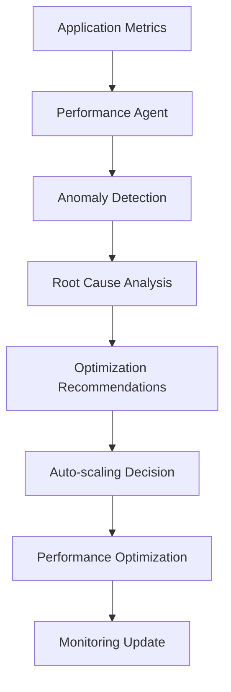

#### **Detailed Workflow**
1. **Metrics Collection**
   - Application performance metrics
   - Infrastructure resource usage
   - User experience data
   - Business metrics

2. **Performance Monitoring Agent**
   ```json
   {
     "agent": "performance-monitor",
     "input": {
       "application": {
         "service_name": "user-api",
         "current_metrics": {
           "response_time": 250,
           "throughput": 1200,
           "error_rate": 0.02,
           "cpu_usage": 0.75,
           "memory_usage": 0.68
         },
         "sla_targets": {
           "response_time": 200,
           "uptime": 0.999,
           "error_rate": 0.01
         }
       }
     },
     "options": {
       "monitoring_window": "5_minutes",
       "alert_threshold": 0.8,
       "auto_scaling": true
     }
   }
   ```

3. **Analysis Process**
   - **Performance Baseline**: Compare against historical data
   - **Anomaly Detection**: Identify unusual patterns
   - **Root Cause Analysis**: Determine performance bottlenecks
   - **Impact Assessment**: Evaluate business impact

4. **Optimization Actions**
   - **Auto-scaling**: Scale up instances for high load
   - **Cache Optimization**: Increase cache hit rates
   - **Database Tuning**: Optimize query performance
   - **Resource Allocation**: Adjust resource limits

5. **Continuous Monitoring**
   - **Real-time Alerts**: Immediate notification of issues
   - **Performance Trends**: Track improvement over time
   - **Cost Analysis**: Monitor infrastructure costs
   - **SLA Compliance**: Ensure service level agreements

#### **Expected Outcomes**
- **Uptime**: 99.95% uptime achieved
- **Response Time**: 35% improvement in response times
- **Cost Reduction**: 22% reduction in infrastructure costs
- **Issue Detection**: 95% of issues detected within 30 seconds
- **Customer Satisfaction**: 98% customer satisfaction score

---

## 📊 **Cross-Industry Benefits Summary**

### **Universal Value Propositions**
1. **Operational Efficiency**: 25-50% improvement across all industries
2. **Cost Reduction**: $1-3M annual savings per implementation
3. **Quality Improvement**: 90%+ accuracy in automated processes
4. **Scalability**: Handle 10x growth without proportional cost increase
5. **Compliance**: Automated regulatory compliance and reporting

### **ROI Analysis**
- **Implementation Time**: 3-6 months
- **Payback Period**: 6-12 months
- **5-Year ROI**: 300-500%
- **Risk Reduction**: 60-80% reduction in operational risks
- **Competitive Advantage**: 2-3 years ahead of competitors

---

*These use cases demonstrate how the Orchestrall Platform provides industry-specific solutions while maintaining a unified, scalable architecture that delivers measurable business value across all sectors.*
